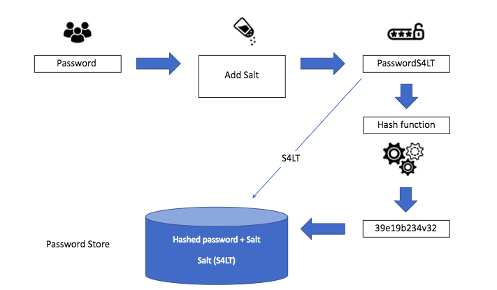

# Authentication, passwords, hashing

----

## Where are we at?

* We implemented link shortner service
* We know how to use Spring Security to protect our controllers

----

## Agenda for today
* Recap: testing with docker
* Live coding storing password in database

----

### Run the application
```
mvn clean package
docker-compose build
docker-compose up
```
---

Alternatively

```
docker run --publish 5432:5432 --env POSTGRES_PASSWORD=mysecretpassword --detach postgres
+ run in IntelliJ IDEA
```

----

## Try application

Create user:
```
curl -X POST http://localhost:8080/users --data '{"email": "test@example.com", "name": "Test", "password": "password"}' -H "Content-Type: application/json" -v
```

Login user:
```
curl -X POST http://localhost:8080/login --data '{"email": "test@example.com", "password": "password"}' -H "Content-Type: application/json" -v
```

Shorten link:
Replaces `JSESSIONID` cookie value with the one that is returned from `/login`

```
curl -X POST http://localhost:8080/links --data '{"url": "https://mkysoft.com"}' -H "Content-Type: application/json"  --cookie "JSESSIONID=D5254338C4C0F61A6FA49B3250D5FA62; Path=/; HttpOnly" -v
```

Expand link:

```
curl http://localhost:8080/xxx -v
```

Alternatively you can call those endpoints from Postman that should handle cookie passing mechanism automatically.

----

## Recap

Testcontainers

----

## Can we store passwords as plain text?

???

---

## Hashing

* "Non-reversable function"


From https://auth0.com/blog/hashing-passwords-one-way-road-to-security/

----

## How reverse is MD5?

Sometimes it is
https://md5.gromweb.com/?md5=482c811da5d5b4bc6d497ffa98491e38

----

## Salt 🧂


From https://www.okta.com/blog/2019/03/what-are-salted-passwords-and-password-hashing/


----

## Home assignment
* Implement hashing with something stronger than MD5


